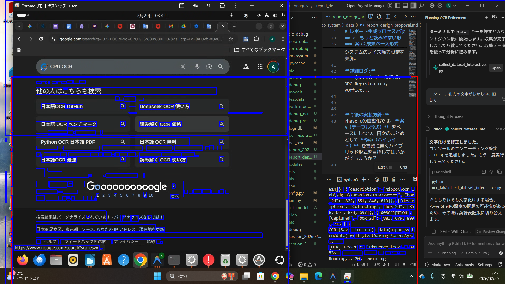
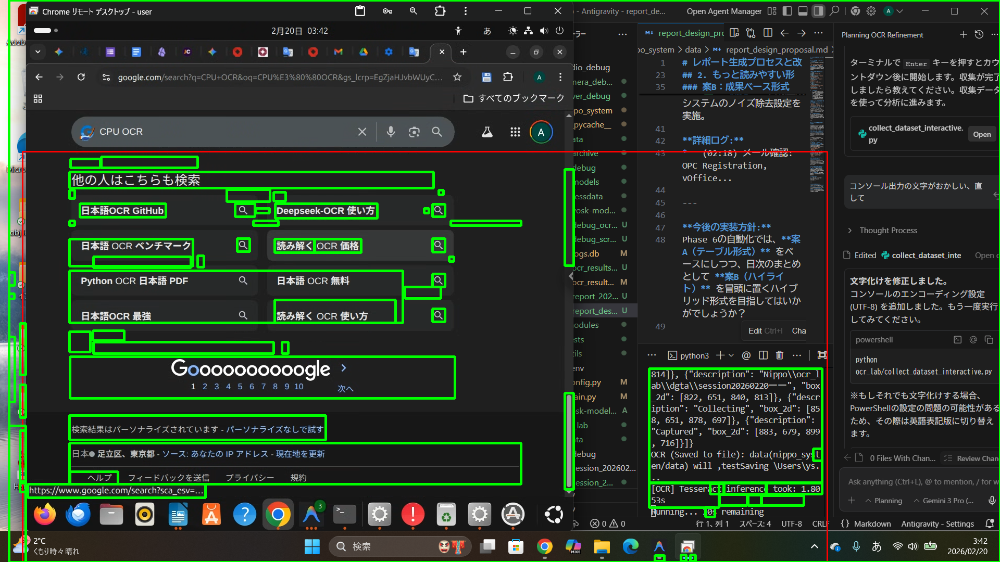
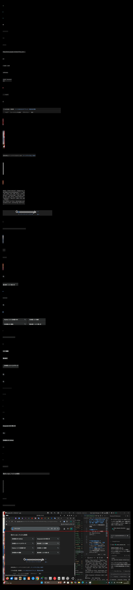

# 結論： 複数の「点」から一つの「行」を組み立てるプロセス

「さっきはたくさん緑の枠（青い枠の集合）があったのに、カンバスでは少なくなっている」という疑問の答えは、システム独自の **「集約ロジック」** にあります。

そのプロセスを3ステップで完全解明します。

## Step 1: 生の差分検知 (240個の点)
まず、画面の変化をピクセル単位で極小のボックスとして捉えます。この時点では、文字の一部分や単語ごとに **240個** ものバラバラな枠が存在します。

## Step 2: 行としてのグループ化 (62個の行ユニット)
OCRエンジン（Tesseract）が文脈を読み取れるように、同じ高さにある小さな枠同士を繋ぎ合わせ、一つの「文章の行」としてまとめ上げます。この時、枠の数は **240個 -> 62個** に集約されます。

*   **失われたわけではありません**: 小さな枠たちは、大きな「行の枠」の中にすべて含まれた状態で、一つのユニットとして扱われます。

## Step 3: OCRカンバスへの配置
集約された62個の「行ユニット」を、黒いカンバスに距離を置いて並べます。

### まとめ
1.  **Step 1（点はたくさん）**: 変化の瞬間をすべて捉える。
2.  **Step 2（枠は行にまとめる）**: 文脈を持たせてOCR精度を上げる。（ここで行の数が減ったように見えます）
3.  **Step 3（カンバスへ）**: 隔離して読み取らせる。

「たくさんあった枠」を「意味のある1行」に昇華させてから配置する。これが、情報の取りこぼしを防ぎつつ、最高の精度を出すための核心技術です。
