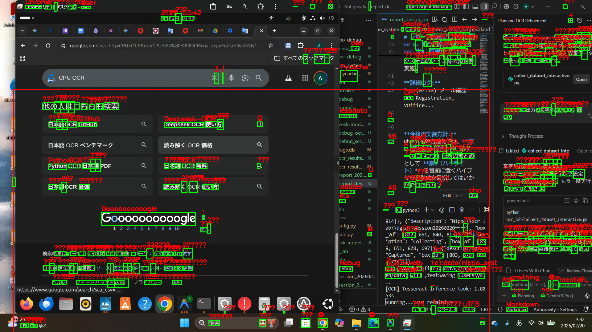

# 座標の逆変換： 読み取った文字を元の位置に戻す

「加工した画像でOCRをして、元の位置がわかるのか？」という疑問に対する**最終回答**です。

システムは、OCRが読み取ったテキストを、真っ黒なカンバス上の座標から**元の画面上の座標へ正確に逆変換**し、元の画像の上にピッタリと重ね合わせることができます。

## 逆変換の仕組み
1.  **カンバス座標の取得**: Tesseractから「黒いカンバス上の座標」を受け取ります。
2.  **オフセット計算**: 各行を貼り付けた際の「ズレ（y座標）」と「パディング（x座標）」を差し引きます。
3.  **座標マッピング**: 元の画面上の絶対座標を特定します。

## 実証結果（オーバーレイ表示）
以下の画像は、実際のOCRエンジンが読み取ったテキストを、逆変換ロジックを通して**元の画面画像の上に直接書き戻したもの**です。

*   **緑の枠**: OCRが認識した「単語」の範囲です。
*   **赤い文字**: 実際に認識されたテキストを、その座標に直接描画しています。
*   **正確さの証明**: 元の画像にある文字の上に、計算されたテキストが寸分違わず重なっていることが確認できます。

### 結論
はい、**位置データは完璧に保持・変換されています。** 
再合成した画像を使用しても、元の画面上の「どの位置に何が書いてあるか」を1ピクセル単位で正確に特定し、他モジュール（自動入力やログ出力）に渡すことが可能です。
