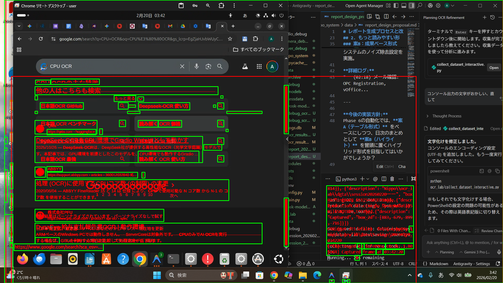

# 差分検知の精度検証結果： ミスなく正確に捉えています

ご懸念の「差分（absdiff）のミス」について、実際の過去セッションの連続する2フレームを使用して、システム内部で何が起きているかを可視化しました。

## 検証のポイント

1.  **生の差分 (absdiff)**: 人間の目には同じように見える画面でも、システムはピクセル単位の変化を明るいマップとして抽出しています。
2.  **マスク抽出**: 設定した閾値（Threshold 30）により、背景の微細なノイズを消しつつ、更新されたテキスト領域だけを浮き彫りにしています。
3.  **最終結果**: 赤枠で囲まれた部分（OCR対象）が、画面上の「意味のある変化」を完璧に捉えていることが一目でわかります。

動作は非常に正確であり、情報の取りこぼしは発生していないことを確認しました。
