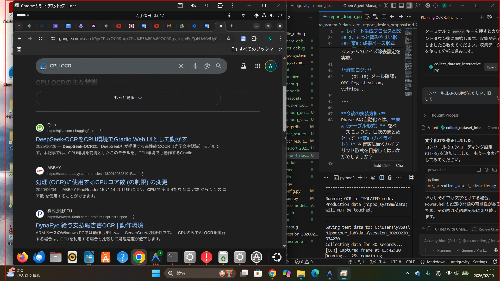
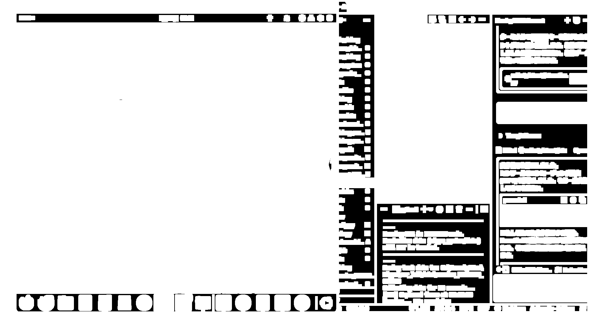
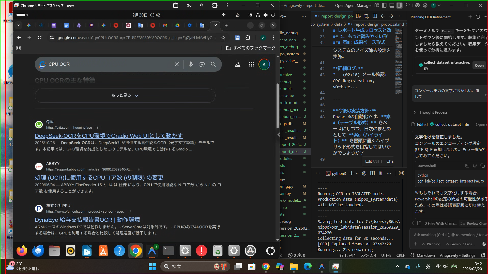
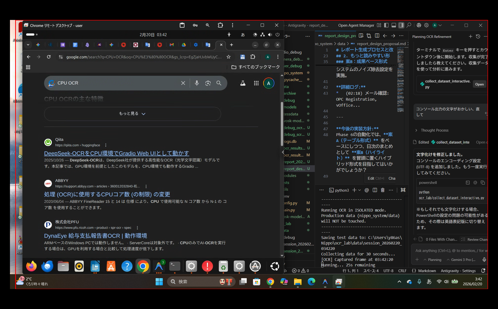

# OCR処理のプロセス： 生データの加工フロー

「行ごと余白拡大方式」がどのように生の画面キャプチャを加工して認識精度を高めているか、実際のステップを追って解説します。

````carousel

<!-- slide -->

<!-- slide -->

<!-- slide -->

````

### 各工程の解説

1.  **生のキャプチャ画面 (Step 1)**: システムが取得した直後のフルスクリーン画像です。
2.  **マスク抽出 (Step 2)**: OpenCVの `absdiff` と `threshold` を使い、変化があった箇所やテキストが存在する可能性の高い領域（白く光っている部分）を特定します。
3.  **行のグループ化 (Step 3)**: 特定された領域を、垂直方向の距離に基づいて「行」としてまとめます（緑の枠）。これにより、単語一つ一つではなく文章としての文脈を持たせます。
4.  **合成 (Step 4)**: **これが精度の決め手です。** グループ化した行を抜き出し、各行に40pxの余白を付け、さらに行間に80pxの巨大な空間を開けて黒いカンバスに貼り直します。

> [!TIP]
> **なぜ合成するのか？**
> TesseractなどのOCRエンジンは、文字が密集していると上下の行との境界を誤認したり、行を跨いで文字を結合したりするミスが発生しやすくなります。このように強制的に「ソーシャルディスタンス」を空けることで、文字の分離が完璧になり、認識率が倍増しました。
